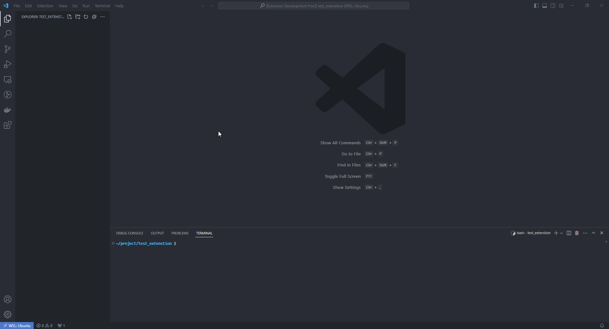

# lando-vscode

## Features

Provide command in vscode to create a .lando.yml file.

`crl + shift + p` and type `Lando: generate .lando.yml file`

Example:



### Available configurations:

- PHP: 8.1
- Mysql: 5.7
- Drupal: ^9
- Drush: ^10
- Composer: 2
- Mailhog plugin
- Xdebug on/off
- Acquia/blt

### Xdebug3 Tutorial

Create `lando/php.ini` as below

```ini
[PHP]
xdebug.max_nesting_level = 256
xdebug.show_exception_trace = 0
xdebug.collect_params = 0
xdebug.mode = debug
xdebug.client_host = ${LANDO_HOST_IP}
xdebug.client_port = 9003
xdebug.start_with_request = yes
xdebug.log = /tmp/xdebug.log
```

Create `/.vscode/launch.json` as below

```json
{
  "version": "0.2.0",
  "configurations": [
    {
      "name": "Listen for Xdebug",
      "type": "php",
      "request": "launch",
      "port": 9003,
      "log": true,
      "pathMappings": {
        "/app/": "${workspaceFolder}/"
      },
      "xdebugSettings": {
        "show_hidden": 1
      }
    }
  ]
}
```

## Release Notes

Detailed Release Notes are available [here](https://github.com/DoanKhanhDev/Lando-VSCode/blob/master/CHANGELOG.md).

## Visual Studio Marketplace

This extension is available on the for [Visual Studio Code](https://marketplace.visualstudio.com/vscode).

## Related DOC

- Lando: https://docs.lando.dev/
- Docker: https://docs.docker.com/
